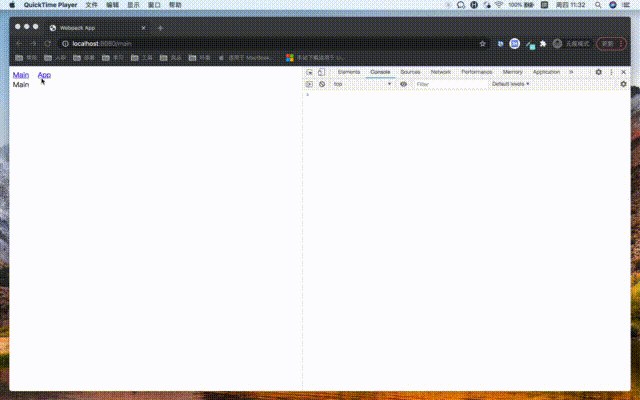

# qiankun-demo

## 启动

```
cd paakages/main
yarn
npm start
```

### 现状
在主应用的 App.tsx 组件使用 `loadMicroApp` 加载了子应用，当主应用从 App 切换到 Main 时，会手动调用子应用的 unmount。
但是因为调用 unmount 的时机太晚，在子应用卸载之前，子应用里面先监听到路由的变化，进入到一个错误的路由。

### 期望
`loadMicroApp` 能够提供一个办法让主应用能在子应用之前先监听到路由的改变，及时卸载子应用


#### 主应用


#### 子应用


#### 录屏


